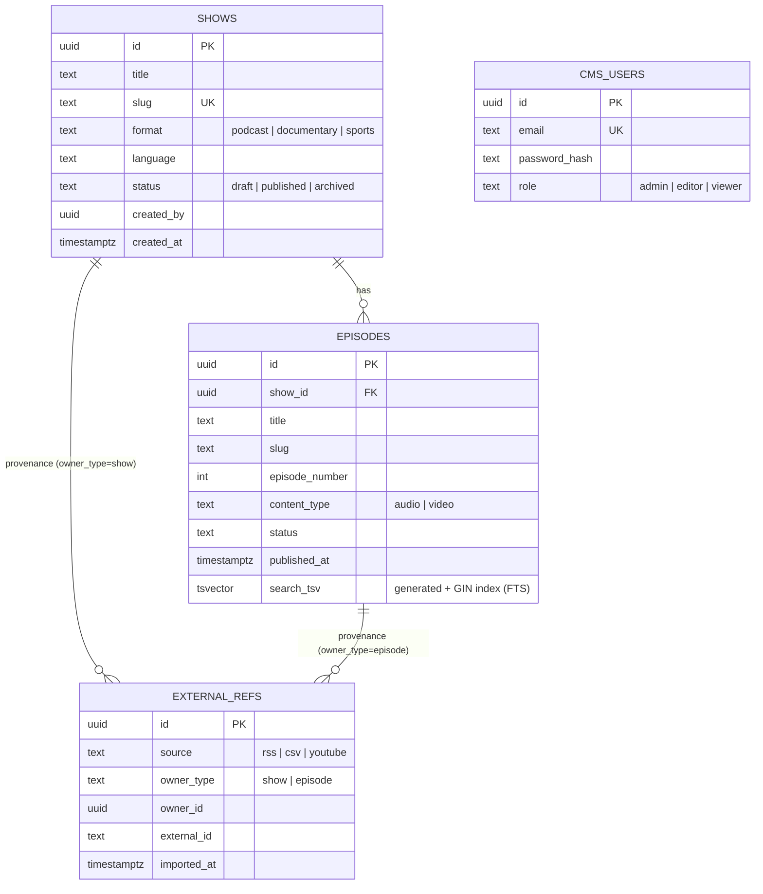

# Thmanyah Assesment

A media catalog backend for thamanyah which splitted be 2 cmds:

- **CMS** (`cmd/cms`) — internal, authenticated. Editors manage shows/episodes and run multi-source imports.
- **Discovery** (`cmd/discovery`) — public, read-only. Full-text search and browse over **published** content.

Both share one Postgres (source of truth). Discovery is cache-backed and built for read scale.

## Quick start

**1. Create your config** from the template and change the values:

```bash
cp config.example.yaml config.yaml
```

**2. Run everything:**

```bash
docker compose up -d --build
# CMS :8080  ·  Discovery :8081  ·  Grafana :3000  ·  Prometheus :9090  ·  Pyroscope :4040
```

Migrations run automatically; an admin user is bootstrapped from config. Override host ports if they clash:

Try it:

```bash
TOKEN=$(curl -s -XPOST localhost:8080/api/v1/auth/login \
  -d '{"email":"admin@thmanyah.local","password":"admin12345"}' | jq -r .access_token)

# import a real podcast feed
curl -XPOST localhost:8080/api/v1/imports -H "Authorization: Bearer $TOKEN" \
  -d '{"source":"rss","query":"https://feeds.npr.org/510289/podcast.xml"}'

# search
curl 'localhost:8081/api/v1/search?q=finjan'
```

## API docs

Each service serves its OpenAPI spec and live Swagger UI:

- `GET /openapi.yaml` — the spec (`api/openapi.yaml`)
- `GET /docs` — Swagger UI

## Database schema



Key constraints (in migrations, not visible above):
- `episodes`: `UNIQUE(show_id, slug)` and `UNIQUE(show_id, episode_number)`.
- `external_refs`: `UNIQUE(source, owner_type, external_id)` — the **idempotency key** for imports. The `owner` is polymorphic, so the links to `shows`/`episodes` are logical (no DB foreign key).
- Search is Postgres FTS via the generated `episodes.search_tsv` (GIN), Arabic-normalized.
